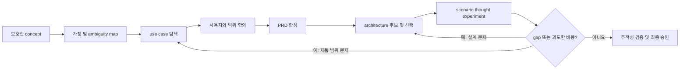

# PRD: Derive Product Spec from Use Cases

## 1. 문서 상태

- 상태: Draft
- 대상 브랜치: `develop`
- 목표 릴리스: `v0.1.0`
- 제품 형태: Codex의 기존 에이전트 실행 환경 위에서 동작하는 멀티에이전트 skill. 독립적인 LLM 호스팅 harness는 초기 범위에 포함하지 않는다.
- 핵심 문장: 모호한 제품 컨셉을 추적 가능한 use case, PRD, architecture로 구체화하고, 각 use case를 architecture에서 thought experiment로 검증해 제품 범위와 기술 설계를 함께 수렴시킨다.

## 2. 문제 정의

사용자는 완성된 요구사항보다 모호한 컨셉, 해결하고 싶은 문제, 일부 scenario만 제시하는 경우가 많다. 일반적인 에이전트는 이 입력에서 곧바로 기능 목록이나 architecture를 작성하기 때문에 다음 문제가 생긴다.

- 에이전트가 추측한 내용과 사용자가 확정한 사실이 섞인다.
- use case, requirement, component 사이의 연결 근거가 사라진다.
- 정상 흐름만 설명하고 실패, 복구, 권한, 상태 변화, 비용과 확장성은 검증하지 않는다.
- architecture의 제약 때문에 핵심 use case가 충족되지 않아도 문서 간 모순이 드러나지 않는다.
- 가치가 작은 edge case 하나가 시스템 전체의 비용과 복잡도를 과도하게 키울 수 있다.
- 여러 전문 역할을 한 에이전트에게 동시에 맡기면 탐색, 작성, 비판이 한 맥락에 섞여 자기검증이 약해진다.

이 제품은 문서를 한 번에 생성하는 도구가 아니라, **제품 가설과 기술 설계를 반복적으로 대조하는 의사결정 workflow**를 제공해야 한다.

## 3. 목표

1. 모호한 입력에서 문제, 사용자, 가치, 제약, 가정과 미확정 사항을 분리한다.
2. 에이전트가 가능한 제품 형태와 use case를 능동적으로 제안하되, 추론을 사실처럼 표현하지 않는다.
3. 제품 가치와 위험에 큰 영향을 주는 ambiguity를 우선순위화하여 사용자와 인터뷰한다.
4. 합의된 use case로부터 PRD를 만들고 requirement까지 추적 가능하게 연결한다.
5. 복수의 architecture 후보와 trade-off를 제시하고 최소한의 충분한 설계를 선택한다.
6. 모든 주요 use case를 선택한 architecture에 통과시켜 누락, 모순, 병목, 실패 복구 문제와 비용을 찾는다.
7. architecture 비용이 제품 가치에 비해 과도하면 architecture 변경뿐 아니라 use case 축소, 단계적 제공 또는 대안도 제안한다.
8. 사용자가 승인한 결정, 거절한 대안, 보류된 질문을 최종 산출물에 명시한다.

## 4. 비목표

초기 버전은 다음을 하지 않는다.

- 자체 모델 서버, queue, scheduler 또는 provider gateway를 구축하지 않는다.
- LangGraph 같은 별도 orchestration framework를 필수 dependency로 도입하지 않는다.
- PRD 승인만으로 제품 코드를 자동 구현하거나 배포하지 않는다.
- 사용자 대신 비가역적이거나 비용이 큰 제품 결정을 확정하지 않는다.
- 근거 없는 가정을 숨기거나 모든 ambiguity가 해결된 것처럼 표현하지 않는다.
- 모든 프로젝트에 enterprise 수준의 보안, 규제, 운영 절차를 기본 적용하지 않는다.
- Codex harness가 제공하지 않는 장기 실행 복구나 영속 세션 기능을 skill 자체가 흉내 내지 않는다.

## 5. 주요 사용자와 진입 조건

### 주요 사용자

- 아이디어는 있지만 제품의 사용자와 핵심 흐름이 불명확한 창업자 또는 기획자
- scenario는 있으나 일관된 PRD가 없는 PM
- PRD는 있으나 architecture가 use case를 실제로 만족하는지 검증하려는 엔지니어
- 가치가 작은 요구사항 때문에 시스템 비용이 급증하는지 판단하려는 팀

### skill을 사용해야 하는 입력

- “이런 서비스를 생각 중인데 무엇을 만들어야 할지 같이 정리해줘.”
- “이 scenario들을 PRD와 architecture로 연결해줘.”
- “이 PRD를 구현하는 architecture가 실제 use case를 만족하는지 검증해줘.”
- “이 edge case를 지원할 가치가 있는지 비용과 대안을 비교해줘.”

단순 문장 편집, 이미 승인된 설계의 코드 구현, 독립적인 architecture review만 필요한 요청에는 자동으로 적용하지 않는다.

## 6. 핵심 workflow



### Phase 1: Intake와 ambiguity map

- 원문 입력을 보존한다.
- 확인된 사실, agent hypothesis, assumption, constraint, unknown을 분리한다.
- 결정 영향도와 되돌리기 어려움을 기준으로 질문 우선순위를 정한다.
- 낮은 위험의 ambiguity는 명시적이고 변경 가능한 가정으로 진행할 수 있다.

### Phase 2: 제품 가설과 use case 탐색

- 사용자, 문제, 기대 가치, 대체 행동과 제품 경계를 복수 후보로 탐색한다.
- happy path뿐 아니라 권한, 실패, 예외, 운영자 흐름을 포함한다.
- 각 use case에 고유 ID, actor, trigger, precondition, main flow, variations, outcome, priority, uncertainty를 부여한다.
- 핵심 아이디어와 관계가 약하거나 비용이 큰 scenario는 별도로 표시한다.

### Phase 3: 제품 범위 합의

- must-have, later, out-of-scope를 사용자와 구분한다.
- 선택지별 사용자 가치, 구현 비용, lock-in과 위험을 설명한다.
- high-impact ambiguity가 남아 있으면 PRD를 확정하지 않는다.

### Phase 4: PRD 합성

- 문제, 목표, 비목표, 사용자, use case, functional requirement, non-functional requirement, acceptance criteria, risk와 open question을 작성한다.
- 각 requirement는 최소 하나의 use case에 연결한다.
- 근거가 없는 requirement를 관행이라는 이유만으로 추가하지 않는다.

### Phase 5: architecture 제안

- 먼저 시스템 경계, 제약, 품질 속성을 확정한다.
- 필요하면 둘 이상의 후보를 비교한 후, 현재 범위에 가장 단순한 충분한 설계를 권고한다.
- component, interface, data/control flow, state ownership, failure/recovery, observability, security와 비용을 설명한다.
- 중요한 선택은 ADR(Architecture Decision Record) 형태로 대안과 결과를 남긴다.

### Phase 6: scenario thought experiment

각 in-scope use case를 다음 순서로 architecture에 통과시킨다.

1. trigger와 entry point
2. identity, authorization과 trust boundary
3. component 간 호출과 interface
4. 읽고 쓰는 data와 state transition
5. 외부 dependency
6. 실패, retry, idempotency와 recovery
7. observability와 결과 증거
8. latency, scale과 비용
9. 사용자가 기대한 outcome

결과는 `SATISFIED`, `ARCHITECTURE_GAP`, `AMBIGUOUS_REQUIREMENT`, `USE_CASE_OVERREACH`, `COST_OR_SCALE_RISK` 중 하나 이상으로 분류한다. 문제가 없을 때도 억지로 gap을 만들지 말고 검토 근거와 함께 `SATISFIED`로 기록한다.

### Phase 7: 조정과 수렴

- architecture gap이면 설계 또는 interface를 최소 범위로 수정한다.
- requirement가 모호하면 PRD와 use case로 돌아간다.
- edge case의 비용이 핵심 가치에 비해 과도하면 범위 축소, 수동 운영, 지연 처리, 별도 tier 또는 단계적 도입을 제안한다.
- 수정 후 영향을 받는 scenario만 다시 실행하되 회귀 가능성이 있는 인접 scenario도 선택한다.
- 합의되지 않은 사항을 숨기지 않고 최종 의사결정이 필요한 상태로 반환한다.

## 7. 멀티에이전트 운영 모델

멀티에이전트는 목적이 아니라 **관점 분리와 독립적인 비판**을 위한 수단이다. 모든 이름을 항상 별도 agent로 실행하면 비용과 latency만 늘 수 있으므로 복잡도에 따라 역할을 합친다.

### 최소 역할

- **Lead / Integrator**: 인터뷰, 작업 분배, canonical artifact 갱신, gate 판단과 사용자 승인 관리를 담당한다. canonical 문서의 유일한 writer다.
- **Product / Use-case Explorer**: 제품 가설, actor, 가치, scenario와 숨은 ambiguity를 탐색한다.
- **Architecture Designer**: requirement와 제약을 바탕으로 후보 architecture와 trade-off를 설계한다.
- **Critic / Scenario Simulator**: 독립적으로 use case를 architecture에 실행해 gap, 과도한 비용과 모순을 찾는다.

### 확장 역할

복잡한 프로젝트에서만 Requirements Critic, PRD Synthesizer, Security/Operations Reviewer, Cost/Scope Critic을 분리한다. 역할 하나가 항상 고정된 agent 하나를 의미하지는 않는다.

### 협업 규칙

- 독립적인 탐색만 병렬화하고, use case → PRD → architecture처럼 의존적인 단계는 gate를 통과한 뒤 진행한다.
- worker에게 전체 대화가 아니라 해당 작업에 필요한 artifact와 명시적 output schema를 전달한다.
- worker는 분석과 제안을 반환하며 canonical file을 직접 동시에 수정하지 않는다.
- Lead는 상충하는 결과를 병합하지 말고 차이를 사용자 또는 critic에게 노출한다.
- 각 결과에는 evidence, assumption, uncertainty와 recommended decision을 구분한다.
- agent 실패나 불완전한 응답은 전체 합의로 위장하지 않고 재시도 또는 제한 사항으로 기록한다.

## 8. 산출물 계약

| 산출물 | 최소 내용 | 완료 조건 |
| --- | --- | --- |
| Concept Brief | 원문 concept, problem, actors, value hypotheses, facts, assumptions, unknowns | 중요한 ambiguity가 식별됨 |
| Use Cases | ID, actor, trigger, precondition, flow, variation, outcome, priority, uncertainty | 범위와 우선순위가 합의됨 |
| PRD | goals, non-goals, scope, requirements, acceptance criteria, risks | requirement가 use case에 연결됨 |
| Architecture | boundaries, components, interfaces, flows, state, NFR, failure/recovery, cost, ADR | 모든 핵심 requirement의 구현 경로가 있음 |
| Scenario Report | UC별 실행 trace, 판정, gap, 비용과 수정 제안 | 모든 in-scope UC가 검토됨 |
| Traceability Matrix | UC → requirement → component/interface → scenario result | 끊어진 연결이 없거나 명시적으로 보류됨 |
| Decision Log | proposed, accepted, rejected, deferred 결정과 이유 | 사용자 승인 상태가 구분됨 |

산출물의 상태는 `DRAFT`, `NEEDS_USER_DECISION`, `VALIDATED_WITH_TRADEOFFS`, `APPROVED`를 사용한다. `APPROVED`는 에이전트가 아니라 사용자의 명시적 승인으로만 부여한다.

## 9. 품질 gate

최종 제안은 다음 조건을 만족해야 한다.

- 모든 in-scope use case가 하나 이상의 requirement에 연결된다.
- 모든 requirement가 use case 또는 명시적인 quality constraint에 의해 정당화된다.
- 모든 주요 use case가 architecture의 component와 interface를 따라 end-to-end로 실행된다.
- component마다 존재 이유가 있으며, 현재 범위에 불필요한 component는 제거 또는 연기된다.
- high-impact ambiguity, 문서 간 모순과 미해결 architecture gap이 숨겨지지 않는다.
- 비용이 큰 requirement에는 가치, 대안과 단계적 도입 여부가 함께 제시된다.
- 사실, 사용자 결정, agent assumption과 recommendation이 구분된다.
- 변경 후 영향을 받는 use case에 대해 회귀 검토가 수행된다.

종료 상태는 다음과 같다.

- `READY_FOR_APPROVAL`: 모든 gate를 통과하고 사용자 승인만 남음
- `APPROVED`: 사용자가 최종 범위와 핵심 trade-off를 승인함
- `NEEDS_USER_DECISION`: 서로 다른 유효한 선택지 중 제품 결정이 필요함
- `BLOCKED_BY_EVIDENCE`: 필요한 사실이나 제약을 확인할 수 없음
- `OUT_OF_SCOPE`: 현재 제품 경계를 넘어 별도 phase 또는 제품으로 분리함

## 10. 설계 원칙

- **Minimum sufficient architecture**: 미래 가능성보다 현재 승인된 use case를 만족하는 최소 계약을 우선한다.
- **Traceability over prose volume**: 긴 설명보다 use case, requirement와 component 간 연결을 우선한다.
- **Durable intermediate artifacts**: 중간 결정과 검증 결과를 보존해 재개와 감사가 가능하게 한다.
- **Single canonical writer**: 여러 agent의 동시 문서 수정으로 생기는 충돌과 암묵적 합의를 막는다.
- **Reversible assumptions**: 낮은 위험의 미확정 사항은 명시적 가정으로 진행하고 쉽게 변경할 수 있게 한다.
- **Value-aware architecture**: 기술적으로 가능한지뿐 아니라 제품 가치 대비 비용이 합리적인지 판단한다.
- **Evidence before certainty**: 확인하지 못한 외부 사실이나 사용자 의도를 확정적으로 표현하지 않는다.

## 11. 참고 harness에서 취할 원칙

### Ouroboros

- 명시적인 workflow state, ambiguity와 진행 상태를 code-level object로 다루는 방식
- 단계별 산출물을 보존하고 다음 단계가 이전 결과를 입력 계약으로 사용하는 방식
- model/provider adapter를 orchestration logic과 분리하는 경계

초기 skill은 Ouroboros처럼 자체 LLM을 hosting하지 않는다. Codex가 orchestration과 model access를 제공하므로, 여기서는 상태와 산출물 계약만 skill 지침과 파일로 표현한다.

### gajae-code

- agent loop, tool execution, UI 및 여러 언어 adapter를 분리하는 harness 관점
- 기능을 prompt 하나에 몰아넣지 않고 interface와 실행 책임으로 나누는 방식
- 운영 가능한 제품에는 skill 외에도 runtime, tool boundary, persistence와 presentation layer가 필요하다는 점

이 프로젝트는 초기에는 gajae-code 규모의 독립 harness를 만들지 않는다. Codex에서 검증된 workflow가 기존 harness의 한계에 막힐 때만 별도 runtime을 검토한다.

### Superpowers 계열 skill repository

- 작은 목적의 skill을 조합하고 controller가 worker를 제한된 맥락으로 호출하는 방식
- 설명의 그럴듯함보다 behavioral scenario와 regression test로 skill을 검증하는 방식
- 개발 자료와 배포 artifact를 분리하고 명시적인 allowlist로 release하는 방식

이 세 프로젝트는 설계 참고 자료이며 release dependency가 아니다.

## 12. 계획된 directory structure

현재 root의 `SKILL.md`와 `agents/openai.yaml`은 bootstrap scaffold다. workflow가 안정되면 다음과 같이 skills-only plugin 구조로 이동한다.

```text
derive-product-spec-from-use-cases/
├── .codex-plugin/
│   └── plugin.json
├── skills/
│   └── derive-product-spec-from-use-cases/
│       ├── SKILL.md
│       ├── agents/
│       │   └── openai.yaml
│       ├── references/
│       │   ├── artifact-contracts.md
│       │   ├── agent-role-prompts.md
│       │   └── evaluation-rubric.md
│       ├── assets/
│       │   ├── concept-brief-template.md
│       │   ├── use-cases-template.md
│       │   ├── prd-template.md
│       │   ├── architecture-template.md
│       │   ├── scenario-report-template.md
│       │   └── traceability-matrix-template.md
│       └── scripts/
│           └── validate-artifacts.py
├── docs/
│   └── prd.md
├── tests/
│   ├── positive/
│   ├── negative/
│   └── regression/
├── scripts/
│   ├── validate-release.ps1
│   └── package-plugin.ps1
└── references/                 # develop-only upstream source submodules
    ├── ouroboros/
    └── gajae-code/
```

두 `references/`의 의미는 다르다.

- repository root의 `references/`: upstream harness를 분석하기 위한 개발 전용 submodule이다. release에 포함하지 않는다.
- skill 내부의 `references/`: 실행 중 필요한 정제된 지침과 계약이다. release에 포함할 수 있다.
- `assets/`: 결과 프로젝트에 복사해 사용하는 template이다.
- `scripts/`: 결정론적으로 검증할 수 있는 구조, ID와 traceability 검사를 담당한다. 제품 판단을 script에 위임하지 않는다.
- `docs/`, `tests/`, repository-level `scripts/`: 개발과 release 검증용이며 배포 plugin에는 명시적 allowlist로 제외한다.

## 13. Release 및 branch 정책

- `develop`: active development, behavioral eval, 개발 전용 upstream reference를 포함한다.
- `main`: release-ready 상태만 PR을 통해 반영한다. `develop`의 내용을 자동으로 전부 병합하지 않는다.
- release package는 allowlist 방식으로 `.codex-plugin/`과 `skills/derive-product-spec-from-use-cases/`만 포함한다.
- root `references/`, `docs/`, `tests/`, repository-level `scripts/`와 Git metadata가 release archive에 없는지 검증한다.
- version은 semantic versioning을 따른다.
  - MAJOR: output contract 또는 workflow의 호환되지 않는 변경
  - MINOR: 호환 가능한 role, stage, artifact 추가
  - PATCH: 계약을 깨지 않는 지침, template 또는 validator 수정

### Release gate

1. `SKILL.md` metadata와 구조 validation 통과
2. positive, negative, regression scenario 통과
3. 산출물 schema와 traceability validator 통과
4. 허용 목록으로 만든 package를 빈 디렉터리에 풀어 재검증
5. development-only reference와 문서가 package에 없음을 확인
6. `develop`에서 release PR을 만들고 review 후 `main`에 반영
7. version tag와 GitHub Release 생성

## 14. 평가 전략

### Positive scenario

- 한 문장의 모호한 제품 아이디어
- 여러 scenario만 있고 제품 경계가 없는 입력
- 기존 PRD와 architecture의 정합성 검증
- 가치가 작은 edge case가 큰 기술 비용을 만드는 사례
- 이해관계자의 요구가 서로 충돌하는 사례

### Negative scenario

- 승인된 spec에 대한 단순 코드 구현 요청
- 문장 교정이나 일반적인 문서 요약
- use case 재구성이 필요 없는 좁은 architecture 질문

### 핵심 지표

- use case → requirement → architecture → scenario result 추적성 비율
- 숨겨진 high-impact ambiguity와 문서 간 모순 발견률
- 근거 없이 생성한 requirement 또는 확정적 주장 수
- 과도한 비용의 use case와 실용적인 대안 식별 여부
- 불필요한 사용자 질문 수와 필요한 승인 누락 수
- 독립 evaluator가 동일한 acceptance criteria로 판단했을 때의 일관성

## 15. 위험과 완화책

- **제품 상상과 hallucination의 혼동**: hypothesis와 fact를 schema에서 분리하고 사용자 승인 전까지 가정 상태를 유지한다.
- **agent 수 증가에 따른 비용과 latency**: 최소 네 역할에서 시작하고 복잡도에 따라 역할을 합치거나 확장한다.
- **끝나지 않는 수정 loop**: 영향도가 큰 gap만 재설계 대상으로 삼고 종료 상태와 iteration budget을 둔다.
- **문서 비대화**: canonical artifact와 부록을 나누고 추적성 없는 내용을 제거한다.
- **사용자 인터뷰 피로**: 높은 영향도의 질문부터 묻고, 낮은 위험은 reversible assumption으로 진행한다.
- **architecture 선호 편향**: 후보별 constraint, trade-off와 rejection reason을 같은 형식으로 비교한다.
- **harness 종속성**: core artifact contract는 가능한 한 도구 중립적으로 정의하고 Codex-specific orchestration은 별도 지침으로 격리한다.

## 16. v0.1.0 acceptance criteria

- 모호한 concept에서 Concept Brief, Use Cases, PRD, Architecture, Scenario Report, Traceability Matrix와 Decision Log를 생성할 수 있다.
- 최소 역할의 agent가 분리된 맥락과 명시적 output contract로 협업한다.
- canonical artifact는 Lead만 갱신한다.
- 모든 in-scope use case가 architecture thought experiment를 통과하고 근거 있는 상태를 받는다.
- 발견된 gap은 architecture 수정, requirement 명확화, use case 변경 또는 명시적 보류 중 하나로 처리된다.
- 비용이 과도한 use case에는 최소 하나의 현실적인 대안과 trade-off가 제시된다.
- 사용자의 명시적 승인 전에는 결과를 `APPROVED`로 표시하지 않는다.
- 외부 LLM hosting framework 없이 Codex의 skill 및 subagent 기능으로 동작한다.
- positive와 negative scenario를 통해 trigger와 workflow behavior가 검증된다.

## 17. 미결정 사항

- 최소 역할을 항상 네 agent로 실행할지, 요청 복잡도에 따라 두세 agent로 합칠지
- 결과 artifact를 대상 프로젝트 내부에 저장할지, 대화에서 먼저 승인받은 뒤 저장할지
- iteration budget과 사용자에게 다시 질문하는 threshold의 기본값
- architecture 비용을 정성 등급으로 시작할지, 프로젝트별 수치 입력을 요구할지
- `v0.1.0`부터 plugin wrapper를 도입할지, skill 단독 behavioral eval 이후 도입할지
- Codex 전용 orchestration과 다른 harness에서도 재사용 가능한 core contract의 경계
