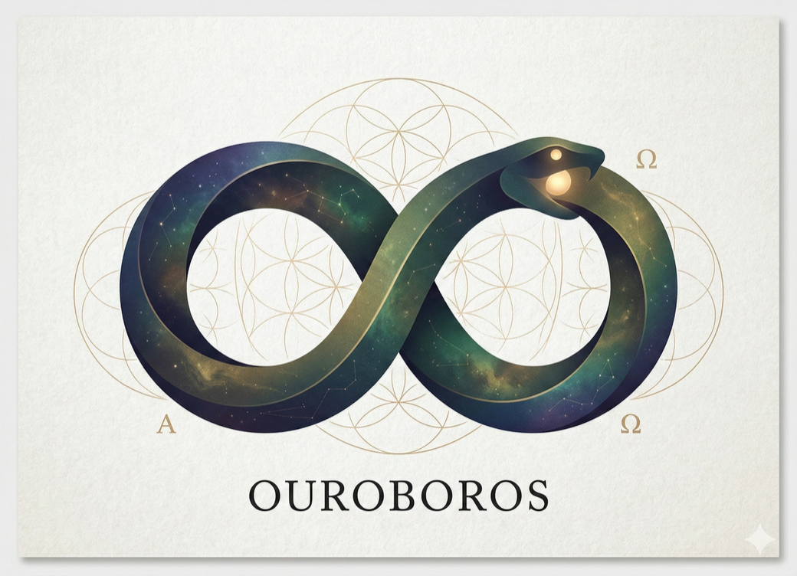
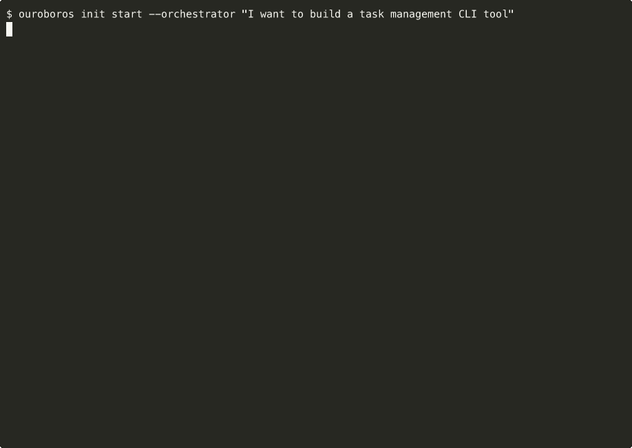
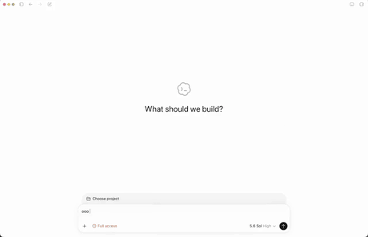
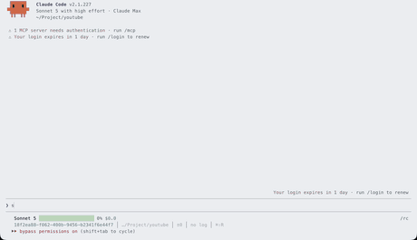
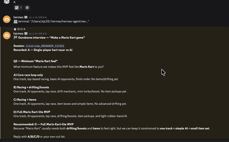
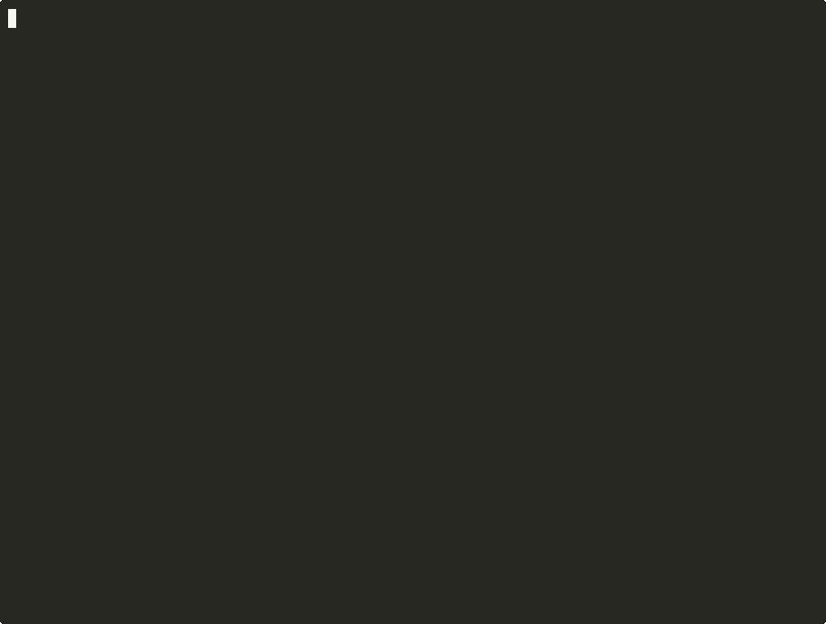

<p align="right">
  <a href="./README.md">English</a> | <strong>한국어</strong> | <a href="./README.zh-CN.md">简体中文</a>
</p>

<p align="center">
  <br/>
  ◯ ─────────── ◯
  <br/><br/>
  
  <br/><br/>
  <strong>O U R O B O R O S</strong>
  <br/><br/>
  ◯ ─────────── ◯
  <br/>
</p>


<p align="center">
  <strong>스스로 똑똑해지는 에이전트, 그 경계는 우리가 정합니다.</strong>
  <br/>
  <sub>프롬프트를 일일이 짜지 않아도, 에이전트는 실행하고 실패하며 세대마다 똑똑해집니다. 채점 명령과 기대 결과값은 우리가 건네는 성공 계약 안에 들어가지 않습니다.</sub>
  <br/>
  <sub>재생 가능한 AI 코딩 워크플로우를 위한 <strong>Agent OS</strong></sub>
</p>

<p align="center">
  <a href="https://github.com/Q00/ouroboros"></a>
  <a href="https://pypi.org/project/ouroboros-ai/"></a>
  <a href="https://github.com/Q00/ouroboros/actions/workflows/test.yml"></a>
  <a href="LICENSE"></a>
  <a href="https://github.com/sponsors/Q00"></a>
</p>

<p align="center">
  <a href="#빠른-시작">빠른 시작</a> ·
  <a href="#wonder에서-온톨로지로">철학</a> ·
  <a href="#순환-구조">원리</a> ·
  <a href="#명령어">명령어</a> ·
  <a href="#아홉-개의-사고">에이전트</a> ·
  <a href="https://ouroboros.page/learn/">가이드</a>
</p>

<p align="center"><sub><b>서로 다른 네 번의 실행, 네 개의 호스트. 과제가 다른 건 의도한 것입니다 — 공유되는 건 엔진이지 프롬프트가 아닙니다</b></sub></p>

<table align="center">
<tr>
<td align="center" width="50%"><br><sub><b>터미널 CLI</b> — 할 일 관리 CLI 과제. <code>ouroboros init start</code>가 순서와 범위를 묻고 모호도 점수를 보고합니다</sub></td>
<td align="center" width="50%"><br><sub><b>ChatGPT (Codex)</b> — 영상 퍼블리싱 하네스 과제. integration으로 호출되어 인터뷰·어드바이저리 레인·모호도 원장이 한 화면에</sub></td>
</tr>
<tr>
<td align="center" width="50%"><br><sub><b>Claude Code</b> — YouTube 자동화 과제. 어드바이저리 6개가 병렬로 돌고 나서 인터뷰가 결과를 제출합니다</sub></td>
<td align="center" width="50%"><br><sub><b>Hermes (Discord)</b> — 카트 레이싱 게임 과제를 챗봇으로. <code>Final ambiguity: 0.15</code>에서 끝납니다</sub></td>
</tr>
</table>

> *AI는 무엇이든 만들 수 있다. 어려운 건 무엇을 만들어야 하는지 아는 것이다.*

Ouroboros는 **명세 우선 AI 개발 시스템**입니다. 이 시스템은 소크라테스식 질문법과 온톨로지 분석을 적용하여, 단 한 줄의 코드도 작성하기 전에 사용자의 숨겨진 가정을 드러냅니다.

대부분의 AI 코딩은 **출력**이 아니라 **입력** 단계에서 실패합니다. 병목 현상의 원인은 AI의 능력이 아니라, 우리가 뭘 만들지 덜 정한 채 시작하기 때문입니다. Ouroboros는 기계가 아닌 인간을 바로잡습니다.

---

## Ouroboros Agent OS 스택

여느 OS와 마찬가지로 Ouroboros도 세 층으로 나뉩니다. 원시 기능을 제공하는 안정적인 **OS 층**, 도메인 워크플로우를 담는 **애플리케이션 층**, 그리고 사람이 실제로 마주 앉는 **셸**입니다. 저장소 셋, 스택 하나입니다.

| 층 | 저장소 | 역할 | 얻는 것 |
| :--- | :--- | :--- | :--- |
| **Shell** (터미널 클라이언트) | [`Ouro-labs/ourocode`](https://github.com/Ouro-labs/ourocode) | 한 세션 안에서 Claude / Codex / Gemini CLI를 넘나들며 `ooo` 워크플로우를 실행하는 네이티브 터미널 UI | TUI, wonderTool 결정 선택기, MCP 패널 상태, 명령 탐색 |
| **Apps** (도메인 워크플로우) | [`Ouro-labs/ouroboros-plugins`](https://github.com/Ouro-labs/ouroboros-plugins) | UserLevel 플러그인 계약 — 코어 원시 기능을 설치 가능한 도메인 프로그램(PR 작업, Jira 동기화, 장애 대응, 릴리스)으로 조립 | 플러그인 매니페스트, 범위 한정 권한, 감사/출처 추적, 참조 플러그인 |
| **OS** (이 저장소) | [`Q00/ouroboros`](https://github.com/Q00/ouroboros) | Agent OS 코어 — Seed, Ledger, Runtime, MCP, 안전 경계 | `ooo` 명령어, 명세 우선 워크플로우 엔진, 다중 런타임 어댑터 |

**어떻게 연결되나:**

```
  ourocode  ──►  ooo / ouroboros-plugins  ──►  ouroboros core (Seed · Ledger · MCP · Runtime)
   shell             user-level apps                        kernel
```

- **커널**(`ouroboros`)이 계약을 소유합니다. 최종 실행을 어느 LLM이 맡든, 모든 행위는 seed에 묶이고 ledger에 기록되는 재생 가능한 이벤트가 됩니다.
- **플러그인**(`ouroboros-plugins`)은 그 계약에 대고 필요한 권한 범위를 선언합니다. 그래서 도메인 워크플로우(PR 리뷰, Linear 티켓 분류, 릴리스 실행)가 일회성 프롬프트가 아니라 감사 가능하고 정책에 묶인 상태로 남습니다.
- **Ourocode**는 터미널 셸입니다. MCP 상태, 인터뷰 질문, wonderTool 결정을 일급 TUI 요소로 드러내므로, 키보드를 떠나거나 여러 CLI를 오가지 않고도 이 OS를 몰 수 있습니다.

지원되는 CLI에 `ouroboros`만 얹어 써도 되고, 도메인 워크플로우가 필요하면 플러그인을 더하고, 통합된 터미널 조종석을 원하면 `ourocode`를 설치하면 됩니다.

> **고지.** Ouroboros 프로젝트와 커뮤니티는 **어떤 암호화폐, 토큰, 밈코인, 트레이딩 커뮤니티와도 무관합니다** — pump.fun을 비롯한 런치패드에 올라온 "ouroboros" 티커도 여기 포함됩니다. 이것은 오픈소스 개발자 도구입니다. 우리는 어떤 코인도 발행하거나, 보증하거나, 보유하지 않습니다. 이 프로젝트와 관련이 있다고 주장하는 토큰은 전부 무단입니다.

> **이름 관련 안내.** "Ouroboros"라는 이름을 쓰는 별개의, 무관한 오픈소스 프로젝트가 하나 더 있습니다 — Anton Razzhigaev의 자가 수정형(self-modifying), 지속 기억형 에이전트(`github.com/razzant/ouroboros`)입니다. 코드 공유도, 관계도 없습니다. 이 프로젝트는 실행 전에 명세를 고정하며 스스로의 아키텍처를 다시 쓰지 않습니다 — 자기 자신의 코드를 고쳐 쓰는 에이전트를 찾으신다면 그쪽입니다.

---

## Wonder에서 온톨로지로

> *Wonder → "어떻게 살아야 하는가?" → "'삶'이란 무엇인가?" → 온톨로지*
> — 소크라테스

이게 바로 Ouroboros의 철학적 토대입니다. 좋은 질문은 더 깊은 질문으로 이어지며, 더 깊은 질문은 언제나 **온톨로지**입니다. 즉, *"이걸 어떻게 하지?"*보다 *"이게 정확히 뭐지?"*를 먼저 묻는 겁니다.

```text
   Wonder                         온톨로지
     💡                               🔬
"내가 원하는 게 뭐지?"      →    "내가 원하는 게 정확히 뭐지?"
"Task CLI를 만들자"         →    "Task가 뭐지? Priority는 뭐지?"
"인증 버그를 고치자"        →    "이게 근본 원인일까, 아니면 증상일까?"
```

이것은 단순히 추상화를 위한 것이 아닙니다. *"Task가 뭐지?"* 라는 질문에 답할 때 — 삭제 가능한 것인가, 보관 가능한 것인가? 혼자 하는 것인가, 팀으로 하는 것인가? — 재작업의 한 유형 전체를 없앨 수 있습니다. **온톨로지 질문이야말로 가장 실용적인 질문입니다.**

Ouroboros는 이 철학을 **Double Diamond** 구조로 풀어냅니다:

```text
    ◇ Wonder         ◇ 설계
   ╱  (넓히기)       ╱  (넓히기)
  ╱    탐색         ╱    창조
 ╱                 ╱
◆ ──────────── ◆ ──────────── ◆
 ╲                 ╲
  ╲    정의         ╲    전달
   ╲  (좁히기)      ╲  (좁히기)
    ◇ 온톨로지       ◇ 평가
```

첫 번째 다이아몬드는 **소크라테스적**입니다. 질문을 넓히고, 온톨로지가 또렷해질 때까지 좁혀 갑니다. 두 번째 다이아몬드는 **실용적**입니다. 설계 옵션을 넓히고, 검증된 결과물로 좁혀 갑니다. 각 다이아몬드는 그 이전 단계가 없이는 성립할 수 없습니다. 이해하지 못한 것은 설계할 수 없기 때문입니다.

---

## 빠른 시작

**설치** — 한 줄이면 전부 자동:

```bash
curl -fsSL https://raw.githubusercontent.com/Q00/ouroboros/main/scripts/install.sh | OUROBOROS_INSTALL_REF=readme-ko bash
```

**첫 명령** — AI 코딩 에이전트를 열고 아래 두 명령을 순서대로 입력하세요:

```
> ooo setup
> ooo interview "I want to build a task management CLI"
```

`ooo setup`은 한 번만 하는 실행 환경 설정이고, `ooo interview`가 설치 후
처음 실행할 워크플로우 명령입니다. 설정이 끝나면 Codex는 현재 선택한 모델을
따르고, Claude Code는 권장 기본 모델 설정으로 시작합니다. 특정 단계의 모델을
고정하고 싶을 때만 **직접 모델 설정하기**를 선택하세요. 내 컴퓨터의 브라우저에
로컬 설정 화면이 열립니다. 나중에 `ooo config`로 언제든 다시 바꿀 수 있습니다.

에이전트 호스트 없이 터미널에서 바로 쓸 수도 있습니다:

```
$ ouroboros init start --orchestrator "I want to build a task management CLI tool"
```

<p align="center">
  <sub>이 페이지 맨 위의 녹화가 바로 이 명령입니다. 설치 전에 먼저 보시라고 위에 뒀습니다.</sub>
</p>

<p align="center">
  
</p>

<p align="center">
  <sub>한 대에서 실행한 <code>ouroboros setup refresh</code>. 그 컴퓨터에 실제로 깔려 있는 호스트에만, 각 호스트가 기대하는 형태로 설치합니다. Codex에는 규칙과 스킬, Hermes에는 스킬, OpenCode에는 플러그인과 <code>AGENTS.md</code>, Pi와 GJC에는 브리지. 내 컴퓨터에서는 13개 중 설치돼 있는 것만 나옵니다.</sub>
</p>

> Claude Code, Codex CLI, GitHub Copilot CLI, OpenCode, Hermes, Gemini, Kiro CLI, Pi CLI, Zcode, Goose, GJC, Antigravity CLI, Grok Build CLI를 지원합니다. 설치 프로그램은 사용 가능한 런타임을 자동으로 감지하고 호스트가 지원하는 경우 MCP 서버를 등록합니다. 런타임을 명시적으로 선택하려면 설치 후 `ouroboros setup --runtime <opencode|kiro|copilot|gemini|pi|zcode|goose|gjc|antigravity|grok>`를 실행하세요. Copilot CLI 런타임은 GitHub Copilot models API를 통해 모델 카탈로그를 실시간으로 검색하고 설정 중 기본값을 선택할 수 있습니다.

<details>
<summary><strong>Codex 플러그인 빠른 시작</strong></summary>

`codex`가 `PATH`에 있어야 하고, 호스트에 `uvx`가 필요합니다(플러그인의 MCP
서술자가 `uvx`로 서버를 띄웁니다). `pipx install uv`, `pip install --user uv`,
`brew install uv` 중 하나로 설치하세요.

```bash
codex plugin marketplace add Q00/ouroboros
codex plugin add ouroboros@ouroboros
```

새 Codex 세션을 연 뒤 아래 명령을 순서대로 입력하세요:

```
ooo setup
ooo interview "Build a task management CLI"
```

`ooo setup`은 한 번만 하는 실행 환경 설정입니다. 준비가 끝나면 Codex의 현재
기본 모델을 따릅니다. 특정 단계의 모델을 고정하고 싶을 때만 **직접 모델
설정하기**를 선택하세요.

</details>

<details>
<summary><strong>Kiro CLI 빠른 시작</strong></summary>

```bash
pipx install 'ouroboros-ai[mcp]'       # 또는: uv tool install 'ouroboros-ai[mcp]'
ouroboros setup --runtime kiro         # Kiro CLI 감지, MCP 서버 등록과 함께
                                        # OUROBOROS_RUNTIME=kiro 를
                                        # ~/.kiro/settings/mcp.json (setup이 관리하는
                                        # 신뢰된 위치)에 기록합니다 — 프로젝트 .env는
                                        # 신뢰되지 않는 입력이라 이 키는 거기서 무시됩니다
```

이후 Kiro CLI 세션에서 `ooo` 명령어를 사용합니다.

</details>

<details>
<summary><strong>GitHub Copilot CLI 빠른 시작</strong></summary>

```bash
gh auth login                                # 최초 1회 GitHub 인증(실시간 모델 검색에 사용)
pipx install 'ouroboros-ai[mcp]'             # 또는: uv tool install 'ouroboros-ai[mcp]'
ouroboros setup --runtime copilot            # 모델 실시간 검색 및 기본값 선택,
                                             # ~/.copilot/mcp-config.json에 MCP 서버 등록
```

Copilot CLI 세션을 다시 시작한 뒤 세션 안에서 `ooo` 명령어를 사용합니다. **모델 ID 변환 범위는 생각보다 좁습니다.** 정적 맵은 `claude-opus-4-6`과 `claude-sonnet-4-5`까지 커버하고, `.`이 이미 들어간 ID는 그대로 통과하며, 하이픈-점 폴백은 **하이픈을 전부** 바꾸기 때문에 현재 기본값 `claude-opus-4-8`은 `claude.opus.4.8`이 되어 매칭에 실패합니다. 역할별 모델을 비워 두어 setup이 발견한 ID를 쓰게 하거나, 점 표기 Copilot ID를 명시하세요. [#1995](https://github.com/Q00/ouroboros/issues/1995)와 [Copilot 런타임 가이드](./docs/runtime-guides/copilot.ko.md) 참고.

자세한 내용은 [GitHub Copilot CLI 런타임 가이드](./docs/runtime-guides/copilot.ko.md)를 참고하세요.

</details>

<details>
<summary><strong>다른 설치 방법</strong></summary>

**Claude Code 플러그인만** (Python 패키지나 전역 Python 설치는 필요 없습니다.
호스트에는 uv만 있으면 됩니다. uv가 제공하는 `uvx`는 MCP 서버를 띄우고,
스킬은 uv를 Python >= 3.12 폴백으로 사용합니다):
```bash
claude plugin marketplace add Q00/ouroboros && claude plugin install ouroboros@ouroboros
```
Claude Code 세션 안에서 `ooo setup` 실행.

**pip / uv / pipx**:
```bash
pip install ouroboros-ai                # 기본
pip install 'ouroboros-ai[claude]'        # + 독립 Claude SDK 프로필(MCP 1.x 기반)
pip install 'ouroboros-ai[litellm]'       # + LiteLLM 멀티 프로바이더; Python 3.12-3.13
pip install 'ouroboros-ai[mcp]'           # + MCP 서버/클라이언트 지원
pip install 'ouroboros-ai[tui]'           # + Textual 터미널 UI
pip install 'ouroboros-ai[all]'           # Claude + LiteLLM + TUI; MCP 2 제외
ouroboros setup                         # 런타임 설정
```

기본 및 비-LiteLLM 설치는 Python 3.12-3.14를 지원합니다. LiteLLM 포함 설치(`[litellm]`, `[all]`, source `--all-extras`)는 Python 3.12-3.13을 지원하며, 현재 예시는 Python 3.13을 권장합니다. 자세한 내용은 [Platform Support](./docs/platform-support.md#python-profile-matrix)를 참고하세요.

`[mcp]`와 `[claude]`는 의도적으로 분리된 프로필입니다. MCP 2와 현재 Claude Agent SDK가 서로 다른 `mcp` 메이저 버전을 요구하기 때문입니다. 지원되는 MCP 호스트 설정은 별도 프로세스에서 `uvx --isolated --python '>=3.12' --from 'ouroboros-ai[mcp]' ...`를 실행합니다. 독립 Claude SDK 설정은 격리 프로세스 안에서 구성된 Claude backend를 사용할 수 없으므로 MCP를 등록하지 않습니다. MCP 실행에는 지원되는 CLI 기반 runtime과 LLM backend를 설정해야 합니다.

`pip install 'ouroboros-ai[mcp]'`는 이미 격리된 Python 환경에서 MCP 클라이언트/서버 라이브러리를 직접 사용할 때만 유효합니다. 호스트 등록에는 `uvx` 또는 `pipx`가 필요하므로 `ouroboros setup --runtime <kiro|copilot|hermes>` 실행 전 `pipx install 'ouroboros-ai[mcp]'` 또는 `uv tool install 'ouroboros-ai[mcp]'`를 사용하세요. 격리 launcher가 없으면 setup은 runtime 설정을 변경하지 않고 실패합니다.

호환성 참고: extras 전환 기간 동안 `ouroboros-ai[dashboard]`도 no-op alias로 계속 허용됩니다.

**Homebrew (macOS/Linux)**:
```bash
brew tap q00/tap
brew install ouroboros-ai
ouroboros setup                         # 런타임 설정
```
homebrew-core에는 아직 등록되지 않은 자가 호스팅 탭입니다. PyPI에 게시된 것과 동일한 패키지를 설치합니다.

런타임별 가이드: [Claude Code](./docs/runtime-guides/claude-code.ko.md) · [Codex CLI](./docs/runtime-guides/codex.ko.md) · [Hermes](./docs/runtime-guides/hermes.md) · [OpenCode](./docs/runtime-guides/opencode.md) · [Kiro CLI](./docs/runtime-guides/kiro.ko.md) · [Gemini CLI](./docs/runtime-guides/gemini.md) · [GitHub Copilot CLI](./docs/runtime-guides/copilot.ko.md) · [Zcode](./docs/runtime-guides/zcode.md) · [Pi JSON mode](https://pi.dev/docs/latest/json) · [Goose](./docs/runtime-guides/goose.md) · [GJC](./docs/runtime-guides/gjc.md) · [Antigravity CLI](./docs/runtime-guides/antigravity.md) · [Grok Build CLI](./docs/runtime-guides/grok.md)

</details>

<details>
<summary><strong>완전 삭제</strong></summary>

```bash
ouroboros uninstall
```

모든 설정, MCP 등록, 데이터를 제거합니다. 자세한 내용은 [UNINSTALL.md](./UNINSTALL.md)를 참고하세요.

</details>

> **MCP 서버로 설치한다면 0.51.1 이상을 쓰세요.** 이전 버전은 기존 환경이 `[mcp]` 프로필을 가릴 때 `Failed to reconnect to plugin:ouroboros:ouroboros: -32000`로 기동에 실패할 수 있습니다([#2012](https://github.com/Q00/ouroboros/issues/2012)). PyPI가 아니라 배포판 패키지로 설치할 때 특히 해당됩니다 — 그쪽은 버전이 뒤질 수 있습니다.

<details>
<summary><strong>무슨 일이 일어났나요?</strong></summary>

```text
ooo interview  →  소크라테스식 질문으로 숨겨진 가정 12개를 드러냄
ooo seed       →  답변을 확정된 스펙으로 정리 (Ambiguity: 0.15)
ooo run        →  Double Diamond로 실행
ooo evaluate   →  3단계 검증: Mechanical → Semantic → Consensus
```

뱀이 한 바퀴를 돌고 나면 다음 바퀴는 다릅니다. 전보다 더 많이 알게 되니까요.

</details>


<p align="center">
  <sub>대개는 리뷰 세 번째 파일쯤에서 자기가 명확하지 않았다는 걸 알게 됩니다.<br/>
  익숙한 기분이라면, 같은 일을 겪을 다음 사람이 이 프로젝트를 찾도록 <a href="https://github.com/Q00/ouroboros"><strong>GitHub의 Q00/ouroboros</strong></a>에 Star를 남겨 주세요.</sub>
</p>

---

## 순환 구조

우로보로스(자기 꼬리를 삼키는 뱀)는 그냥 상징이 아닙니다. 우로보로스는 아키텍처 그 자체입니다:

```text
    Interview → Seed → Execute → Evaluate
        ↑                           ↓
        └──── Evolutionary Loop ────┘
```

각 순환은 같은 걸 반복하는 게 아닙니다. 평가 결과가 다음 세대 입력으로 돌아가고, 시스템이 지금 뭘 만드는지 분명해질 때까지 계속 **진화**합니다.

| 단계 | 수행 내용 |
|:------|:-------------|
| **Interview** | 소크라테스식 질문으로 숨겨진 가정 드러내기 |
| **Seed** | 답변을 확정된 스펙으로 정리 |
| **Execute** | Double Diamond: 발견 → 정의 → 설계 → 전달 |
| **Evaluate** | 3단계 게이트: Mechanical ($0) → Semantic → Multi-Model Consensus |
| **Evolve** | Wonder *("우리가 아직 모르는 게 뭐지?")* → 성찰 → 다음 세대 |

> *"여기서 우로보로스가 자기 꼬리를 삼킵니다: 평가의 출력이*
> *다음 세대 Seed 스펙의 입력이 됩니다."*
> — `reflect.py`

온톨로지 유사도 0.95를 넘기면 거기서 수렴합니다. 질문을 더 돌려도 크게 달라지지 않는다는 뜻입니다.

### Ralph: 멈추지 않는 순환

`ooo ralph`는 수렴에 도달할 때까지 세션 경계를 넘어 지속적으로 진화 루프를 돌립니다. 각 단계는 **무상태(stateless)**로 움직입니다. EventStore가 전체 계보를 다시 만들 수 있어서, 머신이 재시작돼도 뱀은 중단된 지점에서 이어집니다.

```text
Ralph Cycle 1: evolve_step(lineage, seed) → Gen 1 → action=CONTINUE
Ralph Cycle 2: evolve_step(lineage)       → Gen 2 → action=CONTINUE
Ralph Cycle 3: evolve_step(lineage)       → Gen 3 → action=CONVERGED ✓
                                                └── Ralph 종료.
                                                    온톨로지가 안정됨.
```

### 모호성 점수: Wonder와 코드 사이의 관문

Interview는 느낌으로 끝내지 않습니다. **수학적 계산** 점수가 기준 밑으로 내려와야 끝납니다. Ouroboros는 모호성을 `1 - 가중 명확도`로 계산합니다:

```text
Ambiguity = 1 − Σ(clarityᵢ × weightᵢ)
```

각 차원은 LLM이 0.0~1.0 사이 점수를 매기고 (재현성을 위해 temperature 0.1), 여기에 가중치를 곱합니다:

| 차원 | Greenfield | Brownfield |
|:----------|:----------:|:----------:|
| **목표 명확도** — *목표가 구체적인가?* | 40% | 35% |
| **제약 명확도** — *제한 사항이 정의되었는가?* | 30% | 25% |
| **성공 기준** — *결과가 측정 가능한가?* | 30% | 25% |
| **컨텍스트 명확도** — *기존 코드베이스를 이해하고 있는가?* | — | 15% |

**임계값: Ambiguity ≤ 0.2.** 이 값을 넘으면 Seed 생성이 막힙니다. 넘는 방법은 `force`를 명시적으로 넘기는 것이고, CLI가 계속·강제·취소를 화면에 같이 띄웁니다. 이 게이트는 잠금장치가 아니라 반박할 수 있는 기본값입니다.

```text
예시 (Greenfield):

  Goal: 0.9 × 0.4  = 0.36
  Constraint: 0.8 × 0.3  = 0.24
  Success: 0.7 × 0.3  = 0.21
                        ──────
  Clarity             = 0.81
  Ambiguity = 1 − 0.81 = 0.19  ≤ 0.2 → ✓ Seed 생성 가능
```

왜 0.2일까요? 가중 명확도가 80%면 남은 불확실성이 작아서 코드 수준의 판단으로도 충분히 풀 수 있기 때문입니다. 그보다 모호하면 아직 아키텍처를 감으로 정하는 단계에 가깝습니다.

### 온톨로지 수렴: 뱀이 멈추는 시점

진화 루프는 끝없이 돌지 않습니다. 연속된 세대가 온톨로지적으로 같은 스키마를 만들면 거기서 멈춥니다. 유사도는 스키마 필드를 가중 비교해서 계산합니다:

```text
Similarity = 0.5 × name_overlap + 0.3 × type_match + 0.2 × exact_match
```

| 구성 요소 | 가중치 | 측정 대상 |
|:----------|:------:|:-----------------|
| **Name overlap** | 50% | 두 세대에 같은 필드명이 존재하는가? |
| **Type match** | 30% | 공유 필드의 타입이 동일한가? |
| **Exact match** | 20% | 이름, 타입, 설명이 모두 동일한가? |

**임계값: Similarity ≥ 0.95** — 이 선을 넘으면 루프가 수렴하고 멈춥니다.

하지만 유사도만 보는 건 아닙니다. 시스템은 병리적인 패턴도 함께 봅니다:

| 신호 | 조건 | 의미 |
|:-------|:----------|:--------------|
| **정체(Stagnation)** | 3세대 연속 유사도 ≥ 0.95 | 온톨로지가 안정됨 |
| **진동(Oscillation)** | Gen N ≈ Gen N-2 (주기 2 순환) | 두 설계 사이에서 왕복 중 |
| **반복 피드백** | 3세대에 걸쳐 질문 중복률 ≥ 70% | Wonder가 같은 질문만 반복 중 |
| **Hard cap** | 30세대 도달 | 안전장치 |

```text
Gen 1: {Task, Priority, Status}
Gen 2: {Task, Priority, Status, DueDate}     → similarity 0.78 → CONTINUE
Gen 3: {Task, Priority, Status, DueDate}     → similarity 1.00 → CONVERGED ✓
```

기준은 두 개입니다. **충분히 분명해질 때까지는 만들지 않고 (Ambiguity ≤ 0.2), 안정될 때까지는 진화를 계속합니다 (Similarity ≥ 0.95).**

---

## 명령어

> 모든 `ooo` 명령어는 AI 코딩 에이전트(Claude Code, Codex CLI 등) 세션 안에서 실행됩니다.
> 설치 후 `ooo setup`을 실행하여 MCP 서버를 등록(1회)하고, 프로젝트 설정과 통합할 수 있습니다.

| 명령어 | 기능 |
|:--------|:-------------|
| `ooo setup` | MCP 서버 등록 (1회) |
| `ooo interview` | 소크라테스식 질문 → 숨겨진 가정 드러내기 |
| `ooo auto` | 목표 하나에서 A-grade Seed까지 자동 수렴 후 실행 시작 |
| `ooo seed` | 확정된 스펙으로 정리 |
| `ooo run` | Double Diamond로 실행 |
| `ooo evaluate` | 3단계 검증 게이트 |
| `ooo evolve` | 온톨로지 수렴까지 진화 루프 |
| `ooo unstuck` | 막혔을 때 활용 가능한 5가지 수평적 사고 페르소나 |
| `ooo status` | 드리프트 감지 + 세션 추적 |
| `ooo resume-session` | 실행 중인 세션 목록과 재연결 명령 확인 |
| `ooo ralph` | 검증될 때까지 계속 도는 루프 |
| `ooo tutorial` | 대화형 실습 |
| `ooo help` | 전체 참조 |
| `ooo pm` | PM 인터뷰 + PRD 생성 |
| `ooo qa` | 범용 QA 판정 |
| `ooo cancel` | 멈춘 실행 취소 |
| `ooo update` | 최신 버전 확인 + 업그레이드 |
| `ooo brownfield` | 기존 저장소 스캔 + 기본값 관리 |
| `ooo publish` | Seed를 GitHub Epic/Task 이슈로 발행 |

> `ooo publish`는 직접적인 `ouroboros publish` 셸 서브커맨드가 아니라, AI 런타임 세션에서 실행되는 skill/runtime surface이며 내부적으로 `gh` CLI를 사용합니다.

> Claude Code의 `/run`, `/status`, `/help`, `/config`는 예약 명령입니다.
> Ouroboros skill을 직접 호출할 때는 `/ouroboros:ouroboros-run`,
> `/ouroboros:ouroboros-status`, `/ouroboros:ouroboros-help`,
> `/ouroboros:ouroboros-config`를 사용하세요. 기존 `ooo run`, `ooo status`,
> `ooo help`, `ooo config` 문구도 계속 지원됩니다.

---

## 아홉 개의 사고

아홉 개의 에이전트가 있고, 각자 생각하는 방식이 다릅니다. 필요할 때만 로드하고, 처음부터 다 띄워두지는 않습니다:

| 에이전트 | 역할 | 핵심 질문 |
|:------|:-----|:--------------|
| **Socratic Interviewer** | 질문만 한다. 절대 만들지 않는다. | *"지금 뭘 가정하고 있지?"* |
| **Ontologist** | 증상이 아닌 본질을 찾는다 | *"이게 정확히 뭐지?"* |
| **Seed Architect** | 대화를 통해 스펙을 구체화한다 | *"모호함이 사라졌나?"* |
| **Evaluator** | 3단계로 검증 | *"우리가 맞는 걸 만든 건가?"* |
| **Contrarian** | 모든 가정에 의문을 제기한다 | *"반대 상황이 사실이라면?"* |
| **Hacker** | 색다른 경로를 찾는다 | *"진짜 제약이 뭐지?"* |
| **Simplifier** | 복잡성을 제거한다 | *"돌아가는 것 중 제일 단순한 건?"* |
| **Researcher** | 코딩을 멈추고 조사를 시작한다 | *"근거 있어?"* |
| **Architect** | 구조적 원인을 파악한다 | *"처음부터 다시 짜면 정말 이렇게 갈까?"* |

---

## 내부 구조

<details>
<summary><strong>18개 패키지 · 166개 모듈 · 95개 테스트 파일 · Python 3.12+</strong></summary>

```text
src/ouroboros/
├── bigbang/        Interview, 모호성 점수 산정, brownfield 탐색
├── routing/        PAL Router — 3단계 비용 최적화 (1x / 10x / 30x)
├── execution/      Double Diamond, 계층적 AC 분해
├── evaluation/     Mechanical → Semantic → Multi-Model Consensus
├── evolution/      Wonder / Reflect 순환, 수렴 감지
├── resilience/     4가지 정체 패턴 감지, 5가지 측면 페르소나
├── observability/  3요소 드리프트 측정, 자동 회고
├── persistence/    Event Sourcing (SQLAlchemy + aiosqlite), 체크포인트
├── orchestrator/   런타임 추상화 레이어 (Claude Code, Codex CLI)
├── core/           타입, 에러, Seed, 온톨로지, 보안
├── providers/      LiteLLM 어댑터 (100+ 모델)
├── mcp/            MCP 클라이언트/서버
├── plugin/         플러그인 시스템 (스킬/에이전트 자동 탐색)
├── tui/            터미널 UI 대시보드
└── cli/            Typer 기반 CLI
```

**핵심 내부 구조:**
- **PAL Router** — Frugal (1x) → Standard (10x) → Frontier (30x), 실패 시 자동 상향, 성공 시 자동 하향
- **Drift** — Goal (50%) + Constraint (30%) + 온톨로지 (20%) 가중 측정, 임계값 ≤ 0.3
- **Brownfield** — 12개 이상의 언어 생태계에서 15종의 설정 파일 스캔
- **Evolution** — 최대 30세대, 온톨로지 유사도 ≥ 0.95에서 수렴
- **Stagnation** — 스핀, 오실레이션, 드리프트 부재, 수익 감소 패턴 감지

</details>

---

## 실시간 모니터링 (TUI)

Ouroboros에는 실시간 워크플로우를 볼 수 있는 **터미널 대시보드**가 있습니다. `ooo run`이나 `ooo evolve`를 돌릴 때 별도 터미널에서 같이 띄우면 됩니다:

```bash
# 설치 및 실행
uvx --from 'ouroboros-ai[tui]' ouroboros tui monitor

# 로컬 설치된 경우
uv run ouroboros tui monitor
```

| 키 | 화면 | 표시 내용 |
|:---:|:-------|:-------------|
| `1` | **Dashboard** | 단계 진행률, 수용 기준 트리, 실시간 상태 |
| `2` | **Execution** | 타임라인, 단계별 출력, 상세 이벤트 |
| `3` | **Logs** | 레벨별 색상 구분, 필터링 가능한 로그 뷰어 |
| `4` | **Debug** | 상태 인스펙터, 원시 이벤트, 설정 |

> 자세한 내용은 [TUI 사용 가이드](./docs/guides/tui-usage.ko.md)를 참고하세요.

---

## 기여하기

```bash
git clone https://github.com/Q00/ouroboros
cd ouroboros
uv sync --python 3.13 --all-groups
uv run --python 3.13 --no-sync pytest
```

[이슈](https://github.com/Q00/ouroboros/issues) · [토론](https://github.com/Q00/ouroboros/discussions)

---

## 후원하기

Ouroboros는 MIT 라이선스로 공개 개발되는 오픈소스입니다. 이 프로젝트가 재작업을 줄여줬다면 — 혹은 이 루프가 계속 진화하길 바란다면 — 후원을 고려해주세요. 후원금은 유지보수, 새로운 런타임 통합, 후원자 전용 심층 콘텐츠 제작에 직접 사용됩니다.

<p align="center">
  <a href="https://github.com/sponsors/Q00"></a>
</p>

모든 후원자가 이 뱀을 계속 진화하게 합니다. 감사합니다.

---

## 활동

여기 있는 숫자는 GitHub 데이터를 바탕으로 생성되어 자동으로 갱신되며, 캐시로 인해 업데이트가 지연될 수 있습니다.

<p align="center">
  <a href="https://github.com/Q00/ouroboros/graphs/contributors"></a>
  <a href="https://github.com/Q00/ouroboros/commits/main"></a>
  <a href="https://github.com/Q00/ouroboros/pulls?q=is%3Apr+is%3Aclosed"></a>
  <a href="https://github.com/Q00/ouroboros/commits/main"></a>
</p>

---

<p align="center">
  <em>"시작이 곧 끝이고, 끝이 곧 시작이다."</em>
  <br/><br/>
  <strong>뱀은 반복하지 않는다 — 진화한다.</strong>
  <br/><br/>
  <code>MIT License</code>
</p>
