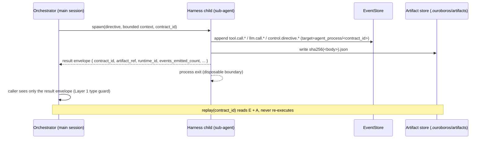

# RFC — Disposable Memory process model and `artifact_ref`

> Status: **Accepted** (Phase 2 of #476 Agent OS roadmap).
> Closes [#512](https://github.com/Q00/ouroboros/issues/512).
> Related: [#476](https://github.com/Q00/ouroboros/issues/476) M3 (I/O Journal payload policy), [#492](https://github.com/Q00/ouroboros/pull/492) (`agent_process` target_type forward declaration), [#511](https://github.com/Q00/ouroboros/issues/511), [#518](https://github.com/Q00/ouroboros/issues/518) (M6 AgentProcess lifecycle).

## Summary

This RFC specifies how *disposable working memory* is bounded for sub-agent invocations: where their outputs live, how they are referenced from the ledger without leaking back into main session context, when they are reclaimed, and how replay treats them.

The RFC narrows itself deliberately. *Lifecycle verbs* (spawn / pause / resume / cancel / replay) belong to [#518](https://github.com/Q00/ouroboros/issues/518). *Wire and failure semantics* belong to [#511](https://github.com/Q00/ouroboros/issues/511). *Persistent cross-session memory* (Hermes Super Memory and the hippocampus / brain-plasticity research track) is **out of scope** — it is a parallel research stream not part of the 1.0 acceptance surface.

Disposable Memory is, in one sentence, the discipline that makes the slide promise *"main ledger holds only `contract_id + artifact_ref`"* survive in code.

## Runtime implementation

The accepted C2-C5 contract is implemented by these production surfaces:

- `core/disposable_memory.py` defines the frozen, extra-forbidden result
  envelope. It has no body or transcript field and is capped by regression
  tests at less than 4 KiB.
- `persistence/artifact_store.py` stores canonical JSON bodies under
  `.ouroboros/artifacts/<sha256-prefix>/<sha256>.json`, binds them to durable
  per-contract manifests, verifies hashes on every explicit fetch, rejects
  Python values that cannot round-trip as JSON, and refuses contract reuse for
  different content. Per-contract manifests, binding files, and
  `.tombstoned` files are recoverable projections. Initial contract records
  and immutable lifecycle genesis/epoch records live in the stable parent.
  A separately committed expected sequence/head digest makes missing tails
  fail closed; retention and terminal transitions are content-addressed and
  hash chained, so projection rollback, substitution, or a crash between
  authority and projection publication is repaired or rejected before replay
  or GC. An epoch is published before its expected head, allowing a uniquely
  validated successor left by a crash to advance the head during recovery.
- `orchestrator/disposable_memory.py` runs child work through `AgentProcess`,
  serializes each contract's effects with a cross-process lock, persists the
  body before completion, and returns only the bounded envelope. Ordinary retry
  recovery reads only the manifest envelope; default replay reads the artifact,
  and explicit force-rerun requires a new contract id.
- The shipped MCP composition routes terminal `ouroboros_submit_fanout_results`
  synthesis through that service. Complete fan-out bodies live only in the
  project-local artifact store; the tool response and EventStore receive the
  bounded envelope. The disposable contract binds the fan-out record and
  canonical validated terminal inputs: an identical retry returns the existing
  envelope without synthesis, while changed child results allocate a distinct
  contract and cannot receive a stale artifact.
- `ouroboros artifacts fetch|replay|prune` exposes explicit inspection and
  dry-run-first GC. `prune --apply` writes a tombstone for every referencing
  contract before deleting a shared blob.

The encoded JSON artifact limit is exactly 1 MiB: 1,048,576 bytes is accepted
and the next byte is rejected. The 1 MiB regression fixture also proves that
the EventStore row and caller envelope remain below 4 KiB and contain no body
substring. A global cross-process file lock serializes reference publication
with pruning, while per-contract locks prevent overlapping retry deliveries
from dispatching child effects twice. Required store directories are created one
component at a time from a pinned project/store anchor; the final directory
handle stays held across lock acquisition and publication. Windows retains a
no-share-delete lease for every ancestor. Failed in-place manifest publication
restores the prior file through the pinned directory handle before reporting
failure. Applied prune pins the digest directory, revalidates the planned body
inode and size through that handle, and performs a directory-relative unlink.
Malformed manifests abort GC fail-closed.

The authority boundary follows the RFC's cooperative local trust model.
Manifest and cache corruption is untrusted and must fail closed or recover from
the stable authority. An actor able to coherently roll back the stable expected
head together with its matching lifecycle tail and every projection, delete or
replace the stable authority itself, or restore the whole project to an older
filesystem snapshot is outside this local store's security contract; detecting
that requires an external rollback-resistant counter or journal.

## Scope

This document **does** decide:
- The execution model for sub-agent invocations.
- The `artifact_ref` backend (storage layout and addressing).
- The garbage-collection policy.
- The mechanism that prevents sub-agent transcripts from leaking into main context.
- The default replay behavior with respect to artifact reuse vs re-execution.

This document **does not** decide:
- AgentProcess lifecycle verbs (deferred to [#518](https://github.com/Q00/ouroboros/issues/518)).
- Mesh transport, envelope, or failure → Directive mapping (deferred to [#511](https://github.com/Q00/ouroboros/issues/511)).
- Contract Ledger schema (deferred to [#513](https://github.com/Q00/ouroboros/issues/513)).
- Hermes Super Memory or any persistent cross-session memory layer — explicitly **out of scope**.

## Inherited from earlier RFCs

| Decision | Source | What it means here |
|---|---|---|
| IPC channel | [#511](https://github.com/Q00/ouroboros/issues/511) D1 — streamable-http + stdio multiplex | Sub-agents do not need a separate channel; the Mesh transport is the IPC. |
| Resource limits | [#511](https://github.com/Q00/ouroboros/issues/511) D7 — `deadline_ms` + `retry_budget` only | CPU/mem caps are RFC #476 Tier-3 C3, gated by usage evidence. |
| Crash → Directive | [#511](https://github.com/Q00/ouroboros/issues/511) D7 — runtime crash → `CANCEL`; schema fail → `CANCEL` | Disposable failures inherit this mapping unchanged. |
| `contract_id = ULID` | [#511](https://github.com/Q00/ouroboros/issues/511) D2 | Sub-agent invocations are addressed by the same id space. |

## Decisions

### C1 — Execution model: harness invocation, no new Python process layer

**Decision.** A sub-agent spawn is a **bounded harness invocation** on top of the existing provider/runtime pattern in `providers/{codex,opencode,gemini}_cli_adapter.py` and `orchestrator/hermes_runtime.py`. The disposable boundary is the harness child process; the spawn passes a constrained context, the harness produces a result envelope, and the child exits when the contract completes.

This RFC does **not** add a Python `multiprocessing` or `os.fork` layer.

**Rationale.** The slide framing of *"each sub-agent forks like an independent process and dies"* is *already true* in the codebase: every harness adapter spawns the harness as a child process. Inventing a Python-level multiprocessing layer on top of that would duplicate the existing isolation, fail on Windows (`os.fork` is POSIX-only, `multiprocessing.spawn` has pickling problems with stateful objects), and add no isolation we do not already have.

**Important framing.** Isolation here is in the **cooperative-trust sense** (#476), not the security sense. A misbehaving sub-agent can still emit forged directives in cooperation; the same trust model the rest of the system uses. This RFC does not pretend otherwise.

**Risks.**
- "Isolation" misread as security isolation. Mitigation: this RFC and the implementation explicitly state cooperative-trust framing.
- Future demand for true sandboxing. Mitigation: the harness pattern allows a sandboxed harness implementation later without changing the disposable contract.

### C2 — Backend: content-addressed filesystem

**Layout.**

```
.ouroboros/artifacts/
  ab/                          # 2-level prefix avoids huge directories
    abc123<sha256>.json        # content-addressed result envelope body
  contracts/
    <sha256(contract_id)>/       # portable; raw ID remains inside the manifest
      events.json              # optional per-contract event dump/manifest
```

`artifact_ref = "sha256:abc123..."` (matches the result envelope shape in [#511](https://github.com/Q00/ouroboros/issues/511) D2). Event dumps are keyed by `contract_id`, not by body hash, so content dedup never overwrites per-contract history.
The public contract ID remains byte-for-byte in the manifest and envelope, but
its filesystem directory is the lowercase SHA-256 of that ID. This avoids
Windows reserved/invalid components and case-insensitive aliasing without
changing semantic identity. The raw-directory layout existed only on unmerged
development snapshots; it is rejected fail-closed rather than auto-migrated,
because case-colliding legacy directories cannot be migrated unambiguously.

**Why content-addressed FS.**
- **Auto-dedup.** Identical sub-agent results across contracts collapse to one file.
- **Single-DB pressure relieved.** The EventStore stays focused on events; bodies do not bloat its WAL.
- **OS tools work.** `du`, `find`, `rsync`, `ls` operate on the artifact tree directly — important for local-first introspection.
- **Single hashing story.** SHA-256 is also used for `prompt_hash` in [#517](https://github.com/Q00/ouroboros/issues/517) M3 I/O Journal; using the same family keeps the operator mental model small.

**Why not external KV (S3 etc.).** RFC #476 Tier-4 Won't (no SaaS).

**Why not SQLite blob.** The EventStore's WAL behavior is not designed for large binary payloads; storing artifacts inline degrades append latency for the rest of the journal.

### C3 — GC: reachability-first + TTL fallback + explicit CLI

```bash
ouroboros artifacts prune              # dry-run; prints what would be deleted
ouroboros artifacts prune --apply      # actually delete
ouroboros artifacts prune --ttl 30d    # override default TTL of 90 days
ouroboros artifacts fetch CONTRACT_ID  # explicit body fetch + hash verification
ouroboros artifacts replay CONTRACT_ID # deterministic read; never re-executes
```

**Algorithm.**

1. Walk the EventStore once and build a reverse index: `artifact_ref -> set(contract_id)` plus each contract's retention state.
2. Protect every artifact referenced by an active contract or by a contract still inside the replay-retention window. These are *active reachable* and are never removed by normal prune.
3. Mark a file under `.ouroboros/artifacts/` for deletion only when its `mtime` exceeds the TTL **and** every referencing contract is outside the artifact-body retention window, or the operator explicitly opts into tombstoning replay bodies with `--allow-replay-tombstone`.
4. Before deleting a content-addressed blob, write a contract-scoped `artifact.tombstoned` event (or durable per-contract tombstone manifest entry) for **each** referencing contract. This fan-out is required because a single deduplicated hash may be shared by many contracts.
5. Delete the blob only after those tombstones are durable. Future replay surfaces *"this artifact was pruned; use `--force-rerun` to recompute"* from the contract's own event stream/manifest rather than a silent missing-file error.
6. Tombstones for still-referenced contracts are retained as part of the replay contract. Tombstones for artifacts whose referencing contracts are also out of retention may be compacted by an explicit ledger-compaction workflow, not by the normal artifact prune path.

**Why local-first / opt-in.** Local-first means GC is never on the hot path; users opt in by running the command. Default policy is conservative (data preservation > disk reclaim). `ouroboros artifacts prune` without `--apply` is a dry-run that prints the candidate list — this is the operator's safety net before destructive action.

**Risks.**
- Disk growth before the operator notices. Mitigation: TTL fallback default (90 days) + dry-run-by-default CLI semantics.
- Tombstone accumulation. Mitigation: only an explicit ledger-compaction workflow may drop tombstones after their referencing contracts are also out of retention; deterministic replay wins over routine GC.
- Hash collision in the SHA-256 namespace. Mitigation: practically zero. Policy is "never silently overwrite" — if a write attempt observes a different existing payload at the same hash, it raises.

### C4 — Context bloat guard: three-layer enforcement

This is the slide promise *"main ledger holds only `contract_id + artifact_ref`"* turned into something that **survives regressions**. Three independent layers because any single layer rots over time.

**Layer 1 — Envelope types.** The Result envelope from [#511](https://github.com/Q00/ouroboros/issues/511) D2 only exposes `contract_id`, `artifact_ref`, `result.status`, `runtime_id`, `duration_ms`, `events_emitted_count`. Sub-agent transcripts are *not a field*. The orchestrator's caller-facing API returns this typed envelope and nothing else; deeper bodies are reachable only via explicit query. The type system itself blocks accidental leakage at compile time.

**Layer 2 — Regression fixture (CI gate).** A test where a sub-agent emits a 1 MB artifact. Assertion: the parent's in-memory context after the call is bounded (e.g., < 4 KB delta, asserted against a high-water-mark probe). This test is wired into CI so that any future PR that quietly enlarges the result envelope fails.

**Layer 3 — Explicit-fetch-only API.** Reading a sub-agent's body is a deliberate call:

```python
events = event_store.get_events_by_contract(contract_id)
artifact = artifact_store.read(artifact_ref)
```

There is *no* implicit accessor that returns a sub-agent's transcript "for free." A grep-able invariant: *no orchestrator code path calls `artifact_store.read` between `spawn` and the next persisted event.* This invariant is testable post-merge by a static check or a runtime assertion in development mode.

**Why three layers.** If any single layer is dropped, the slide promise erodes within a few releases. All three are cheap individually; the discipline is treating them as a set. The common alternative — "developers will remember to keep envelopes small" — is exactly the failure mode this RFC is designed to prevent.

### C5 — Replay default: read artifact + `--force-rerun` opt-in

**Default `replay()` behavior.** Reads from `.ouroboros/artifacts/`. Deterministic, fast, no token spend.

**`--force-rerun`.** Allocates a **new `contract_id`** and runs the work again. This is exactly the rule from [#511](https://github.com/Q00/ouroboros/issues/511) D6: intentional re-execution is a new contract, accidental re-execution via retry is the same contract. Replay inherits that rule rather than inventing a third one.

**Tombstoned artifact path.** If the artifact has been pruned (C3), the default replay first checks the contract-scoped tombstone event/manifest and surfaces that tombstone before asking the user to opt into rerun. **No silent fallback to rerun** — this would corrupt the *replay* verb's promise of determinism.

## Out of scope (explicit)

- **Hermes Super Memory** and any persistent cross-session memory layer. The maintainer's parallel research project on hippocampus modeling and brain-plasticity-inspired forgetting is its own track. Disposable Memory is *the opposite of* Super Memory: disposable is "throw away cleanly," Super Memory is "preserve and forget intelligently." Conflating the two would corrupt both abstractions.
- **CPU/mem resource limits.** RFC #476 Tier-3 C3, gated by usage evidence.
- **Forking and branching of sub-agent state.** RFC #476 Tier-3 C1, gated by usage evidence.

## Sequence diagram — one sub-agent invocation



## Cross-RFC consistency

| Subject | Source | This RFC's behaviour |
|---|---|---|
| IPC channel | [#511](https://github.com/Q00/ouroboros/issues/511) D1 | Inherited; no separate Disposable IPC. |
| Resource limits | [#511](https://github.com/Q00/ouroboros/issues/511) D7 | Inherited; `deadline_ms` and `retry_budget` only. |
| Crash → Directive | [#511](https://github.com/Q00/ouroboros/issues/511) D7 | Inherited; sub-agent crash → `CANCEL`. |
| `artifact_ref` URI scheme | this RFC, C2 | Used in [#511](https://github.com/Q00/ouroboros/issues/511) D2 result envelope. |
| Replay determinism | this RFC, C5 + [#511](https://github.com/Q00/ouroboros/issues/511) D6 | `replay()` reads artifacts; new run = new `contract_id`. |
| Bloat guard | this RFC, C4 | Enforced at envelope, fixture, and API layers. |

## Pre-merge checklist

- [ ] All 5 fresh decisions present (C1–C5), each with option, rationale, risks
- [ ] Inherited-from list explicitly cites [#511](https://github.com/Q00/ouroboros/issues/511) D1 / D7
- [ ] Out-of-scope statement names Hermes Super Memory and persistent cross-session memory
- [ ] Mermaid diagram renders and shows the spawn-to-cleanup loop end to end
- [ ] Cross-references resolve to existing issues / files
- [ ] At least two maintainer approvals
- [ ] C4 three-layer enforcement listed with concrete acceptance examples
- [ ] `artifact_ref = "sha256:..."` linkage matches what [#513](https://github.com/Q00/ouroboros/issues/513) inherits
- [ ] "Replay default = read artifact" matches [#511](https://github.com/Q00/ouroboros/issues/511) D6 + [#518](https://github.com/Q00/ouroboros/issues/518) M6
- [ ] No accidental re-decision of items already settled in [#511](https://github.com/Q00/ouroboros/issues/511)

## Post-merge checklist

- [ ] `docs/rfc/disposable-memory.md` reachable from the docs site (or the README index when it lands)
- [ ] Issue [#512](https://github.com/Q00/ouroboros/issues/512) closed with a back-link to this PR
- [ ] At least one Phase E implementation issue opened referencing this RFC (sub-agent migration to disposable model — `qa-judge` is the candidate first migration)
- [ ] `.ouroboros/artifacts/<prefix>/<sha256>` path layout reflected in `core/project_paths.py` or equivalent

## Rollback

This RFC is implemented by the artifact store, `DisposableMemory` orchestration,
artifact CLI commands, and MCP fan-out synthesis. A rollback must disable the
executable fan-out registration before reverting those runtime surfaces; it must
not restore inline child bodies. Existing `.ouroboros/artifacts` data can remain
on disk for explicit fetch/replay or be removed later through the dry-run-first
prune command. The proposal comment in [#512](https://github.com/Q00/ouroboros/issues/512)
remains the design record.
